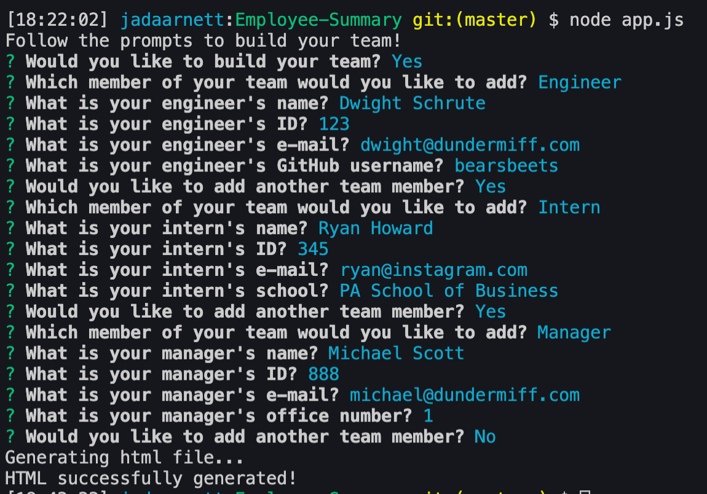
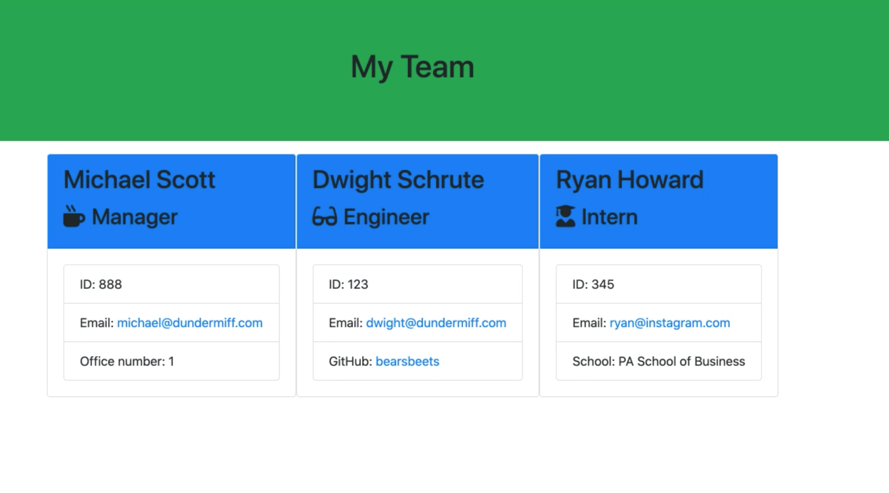

# Employee Summary
Welcome to my Employee Generator application! This is an application that will allow you to generate an HTML of your office team with pertinent information using the command line. This application is great for busy business professionals who need to create and update a roster for their office! 

## Usage 
This application can be used to create a clean HTML page that will display manager, engineer, and intern information. Use the application in your command line by navigating to the application's location and initializing with the command 'node app.js'

Once the application is initialized, follow the prompts to build your team! 

After you are finished adding your final team member, an HTML file will be created with the team member information provided:

## Testing 
This application was built using unit tests powered by jests and those tests can be found in the test folder. 

## License 
MIT 

## Acknowledgements 
I would like to acknowledge two of my classmates for their insight with this application: Sami Sully for helping me understand the unit tests and helping me realize I was overthinking at every single step and Nathan C for talking through the logic of all of the different functions that power the application! 

## Contributing
If interested in contributing, please reach out to me directly via an email at jada.arnett@gmail.com. 
